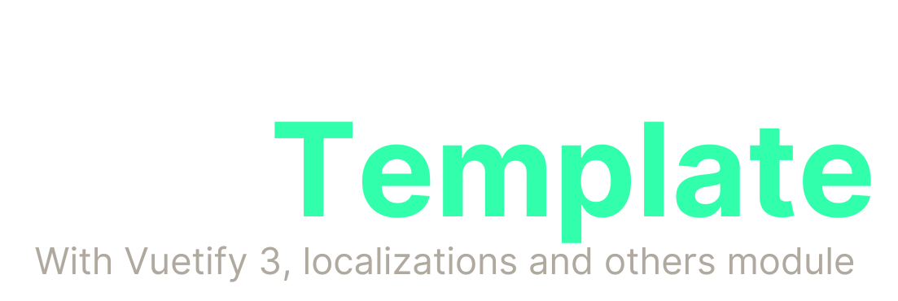

  

This project is a minimal Nuxt 3 starter template with Vuetify. It is a good starting point for building a new Nuxt 3 project with Vuetify.

    
    

## Getting Started
Follow these instructions to set up the project on your local machine for development and testing purposes.
- Clone the repository to your local machine: `git clone https://github.com/andreacw5/nuxt3-vuetify.git`
- Install dependencies: `yarn install`
- Start the application in development: `yarn dev`
- Visit `http://localhost:3000` in your browser to use the application.

### Useful documentation
- [Nuxt 3 documentation](https://nuxt.com/docs/getting-started/introduction)
- [Vuetify documentation](https://vuetifyjs.com/en/)

## Installed modules
- [Nuxt 3](https://nuxt.com)
- [Vuetify](https://vuetifyjs.com/en/)
- [Nuxt i18n](https://i18n.nuxtjs.org/)
- [Nuxt Sitemap](https://sitemap.nuxtjs.org/)

## Requirements
*  [Node.js](https://nodejs.org/en/download) 16.x.x or higher
*  [Yarn](https://yarnpkg.com/en) 1.10.1 or higher

## Contributing
Contributions are welcome! If you want to contribute to this project, please follow these steps:

- Fork the repository.
- Create a new branch (git checkout -b feature/your-feature).
- Make your changes.
- Commit your changes (git commit -am 'Add new feature').
- Push to the branch (git push origin feature/your-feature).
- Create a new Pull Request.

## Versioning
We use [SemVer](http://semver.org/) for versioning. For the versions available, see the [tags on this repository](https://github.com/andreacw5/url-manager-app/releases).

## Author
- [Andrea Tombolato](https://andreatombolato.dev)
